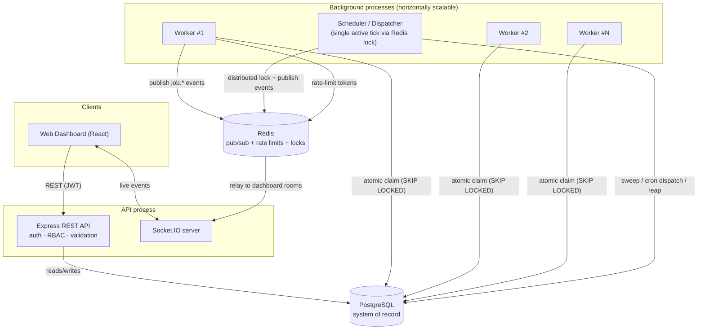
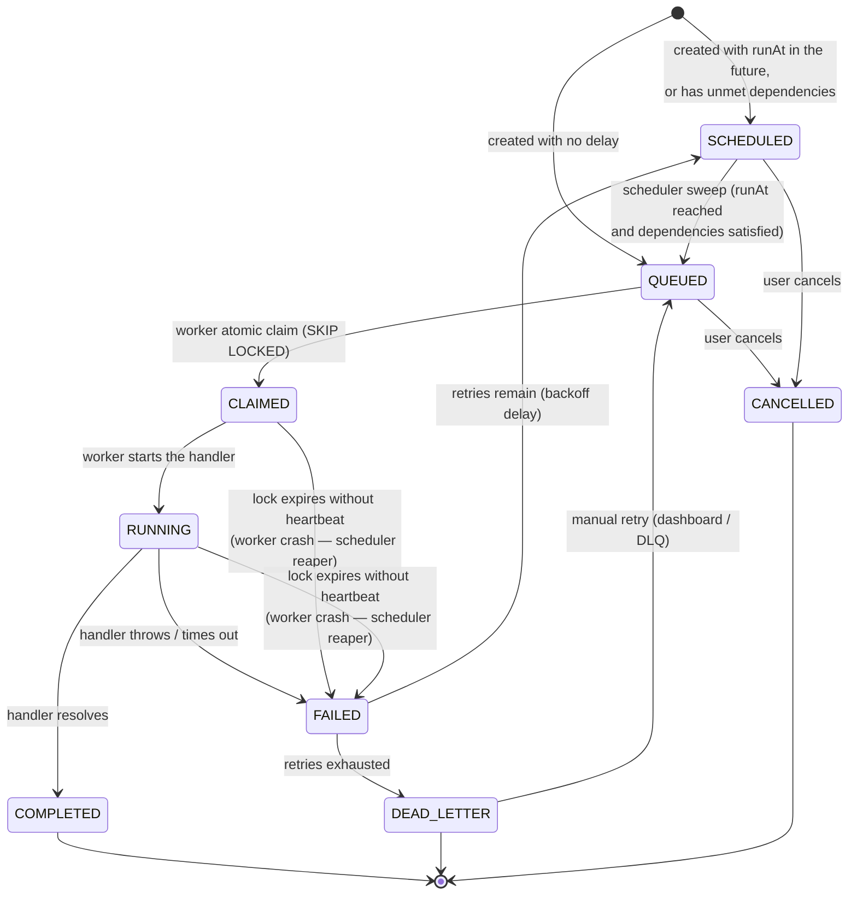

# Architecture

## System diagram

## Processes

| Process | Responsibility | Scales by |
|---|---|---|
| **API** | REST endpoints, auth, RBAC, validation, Socket.IO gateway | Stateless — run N behind a load balancer |
| **Worker** | Polls queues, atomically claims jobs, executes them concurrently, heartbeats, graceful shutdown | Stateless — run N; claiming is safe under concurrency |
| **Scheduler** | Promotes due `SCHEDULED` jobs, dispatches cron `JobDefinition`s, reaps stale claims (crash recovery) | Run N for HA; a Redis lock ensures only one replica does work per tick |
| **Postgres** | Single system of record for every entity — no dual-write, no eventual-consistency between "queue state" and "job state" | Vertical, or read replicas for dashboard queries |
| **Redis** | Cross-process event bus (worker/scheduler → API → dashboard), distributed rate limiting, distributed lock | Managed Redis / cluster |

Nothing in this system requires a message broker (SQS/Kafka/RabbitMQ) — Postgres itself is the
queue, using `FOR UPDATE SKIP LOCKED` for atomic dequeue. This is a deliberate simplification: at
the scale this kind of internal job scheduler typically runs at, a well-indexed Postgres table
comfortably handles claim throughput, and it collapses "job state" and "queue state" into one
transactionally-consistent store instead of two systems that can drift. See
[design-decisions.md](design-decisions.md) for the trade-off.

## Job lifecycle

Every transition in this diagram is implemented in exactly one place
(`packages/core/src/lifecycle.ts` and `claim.ts`), called by whichever process triggers it —
worker, scheduler reaper, or API — so the decision logic (retry vs. dead-letter, when a lock counts
as abandoned) can't drift between call sites.

## Live updates: polling + WebSocket, not either/or

The dashboard polls every 5s via TanStack Query (`refetchInterval`) as a baseline, and layers
Socket.IO push on top: the worker and scheduler publish lifecycle events to a Redis channel
(`packages/core/src/events.ts`), the API process subscribes and relays them into per-project
Socket.IO rooms (`packages/api/src/index.ts`), and the dashboard invalidates the relevant React
Query caches the instant an event arrives (`apps/web/src/components/Layout.tsx`). If the socket
connection drops, the 5s poll still keeps the UI correct — the socket is a latency optimization,
not a correctness dependency.

## Reliability mechanisms at a glance

- **Atomic claim** — a single `WITH ... FOR UPDATE SKIP LOCKED` CTE feeding an `UPDATE`, so two
  workers can never claim the same row (see `packages/core/src/claim.ts`). Verified under real
  concurrency in `packages/core/src/claim.integration.test.ts`.
- **Crash recovery** — every claim carries a `lockExpiresAt`, extended to cover the job's
  `timeoutMs` when execution starts. If a worker dies mid-job, the scheduler's reaper
  (`reapStaleClaims`) notices the expired lock and routes it through the same retry/DLQ decision
  as a normal failure — no job is silently stuck forever.
- **Distributed lock** — the scheduler wraps each tick in a Redis `SET NX PX` mutex
  (`packages/core/src/lock.ts`) so running two scheduler replicas for HA can't double-dispatch the
  same cron `JobDefinition`.
- **Distributed rate limiting** — a queue's `rateLimitPerSecond` is enforced fleet-wide via a
  Redis counter keyed by second (`packages/worker/src/rate-limiter.ts`), not per-worker, so the
  limit holds regardless of how many workers are polling that queue.
- **Idempotent job creation** — a job's `(queueId, idempotencyKey)` pair is unique at the database
  level; re-submitting the same key returns the existing job instead of creating a duplicate.
- **Workflow dependencies** — a job created with `dependsOn` stays `SCHEDULED` until every
  prerequisite reaches `COMPLETED` (enforced by a `NOT EXISTS` clause in the scheduler's sweep),
  so a downstream job can never start before its inputs are ready.
