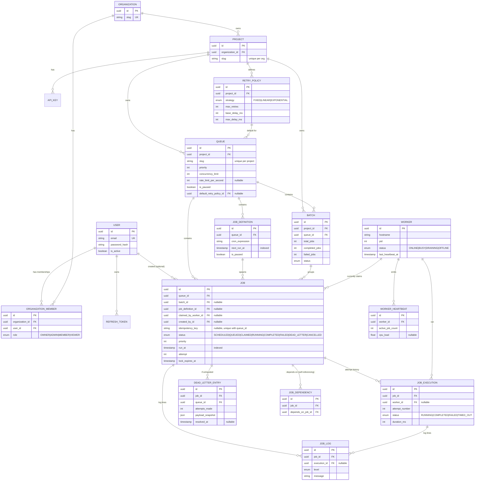

# Entity-Relationship Diagram

Source of truth: [`packages/db/prisma/schema.prisma`](../packages/db/prisma/schema.prisma).

## Design notes

### Primary keys
Every table uses a `uuid` primary key (`@default(uuid())`), generated application-side rather than
via a database sequence. This lets the API construct a job's ID before insert (useful for
idempotent client retries) and avoids leaking row counts, and it means IDs are globally unique
across tables without coordination — relevant if this schema is ever sharded (see
[design-decisions.md](design-decisions.md#queue-sharding)).

### Foreign keys and cascading behavior
- **`Organization → Project → Queue → Job`** cascade on delete (`onDelete: Cascade`). Deleting a
  project is meant to delete everything it owns — there's no use case for an orphaned queue.
- **`Job → JobExecution/JobLog/DeadLetterEntry`** also cascade — execution history has no meaning
  independent of its job.
- **Nullable, `SetNull` foreign keys** are used wherever the referenced row is allowed to disappear
  without invalidating the referencing row: `Queue.defaultRetryPolicyId`, `Job.claimedByWorkerId`,
  `Job.createdById`, `Job.batchId`, `Job.jobDefinitionId`. A worker being decommissioned shouldn't
  delete the jobs it once ran; the job's `lastError`/history stands on its own.
- **`JobDependency`** is a many-to-many self-join on `Job` (`dependsOnJobId` / `jobId`), both
  `onDelete: Cascade` — deleting either side of a dependency edge removes just that edge.

### Indexes
Indexes are chosen for the two access patterns that actually run at high frequency, not
speculatively:
- `Job(queueId, status, priority, runAt)` — the exact filter/sort the atomic claim query uses
  (`WHERE queue_id = ? AND status = 'QUEUED' AND run_at <= now() ORDER BY priority DESC, run_at ASC`).
  This is the hottest query in the system; it's a covering index for it.
- `Job(status, runAt)` — the scheduler's system-wide sweep for due `SCHEDULED` jobs, independent of
  queue.
- `JobDefinition(nextRunAt)` — the cron dispatcher's "what's due" query.
- `JobLog(jobId, timestamp)` and `JobExecution(jobId)` — the job detail page's execution/log
  history, always fetched by job.
- `WorkerHeartbeat(workerId, timestamp)` — heartbeat history for a single worker's chart.

Every foreign key column not already covered by one of the above also has its own index
(`batchId`, `jobDefinitionId`, `claimedByWorkerId`, etc.) so cascading deletes and dashboard
lookups by parent don't table-scan.

### Normalization
The schema is in 3NF with one deliberate denormalization: `Job` carries its own optional
`maxRetries` / `retryStrategy` / `baseDelayMs` / `maxDelayMs` / `timeoutMs` columns that, when
`NULL`, fall back to the queue's `defaultRetryPolicy`. This is a conscious trade-off — modeling it
"purely" would mean every job always points at a `RetryPolicy` row, but then a one-off override for
a single job (e.g. "this one job needs 10 retries, not the queue's usual 3") would require minting
a throwaway policy row for no reuse. The override columns keep the common case (inherit the
queue's policy) fully normalized while making the uncommon case (per-job override) cheap. See
`resolveRetryPolicy` in `packages/core/src/lifecycle.ts` for the precedence rule.

### Performance considerations
- `Job.payload`, `JobDefinition.payload`, `JobExecution.resultPayload`, `DeadLetterEntry.payloadSnapshot`,
  and `JobLog.metadata` are all `Json` columns (Postgres `jsonb`) rather than normalized tables —
  job payloads are arbitrary, application-defined shapes that are only ever read/written whole,
  never queried by internal field, so `jsonb` is strictly better here than EAV-style normalization.
- `JobExecution` (one row per attempt) is kept separate from `Job` (one row per logical job)
  specifically so retry history is queryable without ever mutating past attempts — `Job.attempt`
  is a fast-path counter, `JobExecution` is the audit trail.
- All timestamp columns needed for time-range queries (`runAt`, `createdAt`, `completedAt`,
  `movedAt`, heartbeat `timestamp`) are plain `timestamp` types indexed where they're filtered on,
  so the dashboard's "last hour" / "last 24h" aggregations stay index-range-scans rather than full
  table scans as the tables grow.
